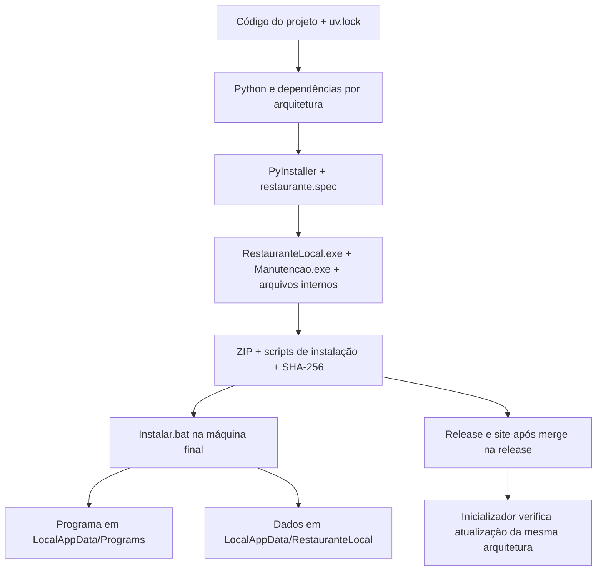

# Como o empacotamento funciona e como reproduzir

O código continua sendo Python/Django. O PyInstaller monta uma distribuição que inclui um interpretador Python, as bibliotecas necessárias e os arquivos da aplicação. O executável inicia esse Python incluído; a máquina do restaurante não precisa instalar Python ou ferramentas de desenvolvimento. Isso é empacotamento, não uma reescrita do sistema em outra linguagem.

## Caminho do código até a máquina final



1. **Preparação:** uv obtém Python e instala exatamente as dependências de `uv.lock`, com `--frozen`. As ferramentas e o Python estão fixados em `packaging/toolchain.json`.
2. **Coleta:** `packaging/restaurante.spec` informa ao PyInstaller quais módulos, templates, CSS, JavaScript, comandos Django e migrations precisam acompanhar o programa. A coleta explícita permite que o Django encontre arquivos normalmente descobertos pelas pastas do projeto.
3. **Executáveis:** `packaging/entrypoint.py` atende dois programas. `RestauranteLocal.exe` inicia `run_local`, servidor local, equipamentos e bandeja; `Manutencao.exe` executa comandos de instalação, backup e migrations.
4. **Distribuição:** `packaging/build.py` reúne os executáveis, pasta `_internal`, licenças, manual e scripts Windows em um ZIP. Grava versão, revisão e arquitetura; calcula o SHA-256 do ZIP e prepara o manifesto web.
5. **Instalação:** `Instalar.bat` chama `Update.ps1`, que valida o pacote, prepara os dados e cria o atalho. O programa e o banco ficam em locais separados.
6. **Atualização:** o atalho chama `Launch.ps1`, que consulta o canal x86 ou x64. Quando há outra revisão publicada, `Update.ps1` verifica o hash, faz backup e só ativa o programa novo após preparar os dados. Falha de rede mantém a versão instalada utilizável.

O formato é **uma pasta com executáveis e dependências**, chamado `onedir` no PyInstaller. Por isso, não basta copiar apenas `RestauranteLocal.exe`: é preciso preservar todo o pacote, principalmente `_internal`.

## Banco, backups e arquivos baixados

No Windows, `%LOCALAPPDATA%` é a pasta de dados do usuário conectado, normalmente `C:\Users\nome-do-usuario\AppData\Local`. A aplicação não mantém o banco dentro do repositório ou da pasta do executável.

| Conteúdo | Caminho padrão |
| --- | --- |
| Banco SQLite | `%LOCALAPPDATA%\RestauranteLocal\db.sqlite3` |
| Configuração de instalação | `%LOCALAPPDATA%\RestauranteLocal\installation.json` |
| Backups | `%LOCALAPPDATA%\RestauranteLocal\backups\<data-hora>\` |
| Programa e scripts do atalho | `%LOCALAPPDATA%\Programs\RestauranteLocal\` |
| Programa por versão | `%LOCALAPPDATA%\Programs\RestauranteLocal\versions\<hash>\` |
| Apontador para a versão ativa | `%LOCALAPPDATA%\Programs\RestauranteLocal\current.json` |

`LOCAL_WEIGHING_DATA_DIR`, em configuração de ambiente ou `.env`, pode mudar a pasta de dados. `-InstallRoot` pode mudar a pasta do programa. Bancos dos testes e ensaios usam pastas temporárias isoladas.

**Quando ocorre backup:** `initialize_local` faz backup sempre que é executado e encontra banco ou `installation.json`, antes de mudar a configuração e aplicar migrations. O instalador e uma atualização efetiva chamam esse comando com o programa fechado. Na primeira instalação sem dados ainda não há o que copiar. Apenas abrir, consultar atualizações ou detectar que a revisão já está instalada não faz backup. Não há rotina diária de backup.

Cada backup cria uma pasta com data/hora, incluindo microssegundos, e contém o banco `db.sqlite3` e o `installation.json` que existirem. Usa a operação de backup do SQLite. Os backups permanecem no mesmo disco, sem expiração automática. O `.env` compartilhado é preservado na instalação, mas não é incluído nessa cópia de backup.

**Durante uma atualização online:**

```text
Programs\RestauranteLocal\
  staging-<identificador>\
    release.zip           ← download temporário
    extracted\            ← extração temporária
  versions\
    <hash-antigo>\        ← programa anterior preservado
    <hash-novo>\          ← programa novo
  current.json            ← passa a apontar para <hash-novo> após sucesso
```

O ZIP não é descompactado por cima da versão ativa. O atualizador confere SHA-256, extrai em staging, copia o programa para a nova pasta, prepara os dados com backup e troca o apontador somente após sucesso. Os scripts estáveis da raiz, como `Launch.ps1` e `Update.ps1`, são atualizados; o banco permanece na pasta de dados.

A pasta staging, incluindo `release.zip` e a extração temporária, é removida na conclusão normal e também no tratamento normal de erro. Uma interrupção abrupta do Windows pode deixar staging residual. As pastas de versões anteriores não são removidas automaticamente.

O ZIP que você baixou manualmente para a primeira instalação continua na pasta em que foi salvo, assim como sua pasta de extração: o instalador não apaga a origem. Os ZIPs gerados no computador de desenvolvimento também permanecem em `dist/`.

## Reproduzir com dois cliques

Use um **computador de desenvolvimento com Windows 10/11 de 64 bits**, Git instalado e uma cópia deste repositório. A máquina de build pode gerar os dois formatos; o restaurante com Windows de 32 bits recebe o pacote x86.

Na raiz do projeto, dê dois cliques em **Empacotar.bat**. Ele:

- baixa uv e a ferramenta local RTK em versões fixadas, conferindo SHA-256, e guarda em `.build-tools/`;
- prepara Python 3.13.14 x86 e x64 em `.uv-python/`;
- cria ambientes próprios `.venv-build-x86/` e `.venv-build-x64/`, preservando o ambiente de desenvolvimento existente;
- executa checks Django, verificação de migrations e a suíte de testes em cada arquitetura;
- gera cada ZIP e ensaia instalação, encerramento HTTP, integridade e atualização com dados temporários e equipamentos simulados;
- grava um relatório em `dist/build-report.json` e um log em `build/logs/`.

O primeiro uso precisa de internet para baixar ferramentas, Python e dependências. Execuções posteriores reaproveitam o cache. As ferramentas permanecem locais ao projeto: não há instalação global de Python ou uv. RTK é usado pelos testes do inicializador de desenvolvimento e não entra no ZIP final.

A versão vem de `[project].version` em `pyproject.toml`; a revisão vem de `git rev-parse HEAD`. O script avisa se houver alterações locais e registra essa condição no relatório. Nesse caso, o pacote contém o código atual da pasta, incluindo as alterações ainda sem commit. Para reproduzir uma versão publicada, faça checkout do commit da Release em uma cópia limpa antes de empacotar. Esse checkout é uma ação manual; o comando de build não troca branches, não cria commits nem faz push.

## Gerar somente um formato ou informar versão

No PowerShell, a partir da raiz:

```powershell
# Somente o pacote do computador do restaurante:
rtk proxy powershell.exe -NoProfile -ExecutionPolicy Bypass -File packaging/Build-Windows.ps1 -Architecture x86

# Ambos os formatos, versão informada explicitamente:
rtk proxy powershell.exe -NoProfile -ExecutionPolicy Bypass -File packaging/Build-Windows.ps1 -Architecture all -Version 0.1.1
```

`-SkipTests` permite um build rápido para investigação; o relatório marca os pacotes como **não validados**. O fluxo padrão e o GitHub executam as verificações completas. Use o fluxo completo antes de entregar uma versão.

O build bloqueia outra execução desse mesmo comando na pasta enquanto estiver em andamento. Nenhuma etapa abre COM ou envia impressão real.

## Onde ficam os resultados

| Arquivo ou pasta | Finalidade |
| --- | --- |
| `dist/RestauranteLocal-windows-x86.zip` | Entrega para Windows de 32 bits |
| `dist/RestauranteLocal-windows-x64.zip` | Entrega para Windows de 64 bits |
| `dist/*.zip.sha256` | Hash de cada ZIP |
| `dist/update-web/x86/` e `dist/update-web/x64/` | Manifestos e pacotes dos canais de atualização |
| `dist/build-report.json` | Revisão, versão, ferramentas, arquitetura, hashes e indicação de validação |
| `build/logs/` | Log para entender uma falha |
| `build/` e `dist/x86/`, `dist/x64/` | Arquivos intermediários gerados pelo PyInstaller |

Se uma etapa falhar, o comando retorna erro e interrompe as seguintes. Não considere ZIPs antigos presentes em `dist/` como resultado de uma execução que falhou. O relatório de sucesso só é criado ao concluir todas as arquiteturas solicitadas.

## Local e GitHub usam o mesmo processo

O workflow `.github/workflows/windows-deploy.yml` chama `packaging/Build-Windows.ps1` para x86 e x64. O mesmo comando prepara, testa e empacota em ambos os ambientes. A publicação é uma etapa adicional do workflow: depois dos dois builds aprovados, cria a Release e publica o site.

**Empacotar localmente não publica nada.** O desenvolvimento fica em `codex/develop`; a main distribui código aprovado pelo canal Git/uv. PR e merge autorizado da main para `release` publicam os executáveis e o site. O build não inclui `.env`, banco, dados, logs operacionais ou RTK.

As versões fixadas permitem repetir o processo e manter as mesmas dependências. Os ZIPs não são prometidos como idênticos byte a byte: timestamps e metadados do empacotamento podem alterar o hash. O SHA-256 identifica o ZIP efetivamente produzido em cada execução.

## Adaptar para outro projeto

O pacote inclui `Desinstalar.bat` e `Uninstall.ps1`. A instalação registra os caminhos em `uninstall-info.json`, inclusive raízes de dados personalizadas e origens manuais. O desinstalador oferece preservar dados ou apagá-los integralmente com todos os backups. Resíduos por falha e arquivos preservados são informados com seus caminhos. Consulte o procedimento em [Distribuição Windows](DISTRIBUICAO_WINDOWS.md#configurações-e-suporte) e a [ADR-0031](adr/0031-desinstalacao-com-dados-opcionais.md).

A estrutura reutilizável é: comando de build, lista explícita de arquivos no `.spec`, ponto de entrada, dependências fixadas, scripts de instalação e manifesto de atualização. Porém, copiar esses arquivos sem adaptar não gera outro aplicativo: os nomes dos módulos, caminhos, comandos Django, assets, pasta de dados e endereços de publicação pertencem a este projeto.

Comece pelo `.spec` e pelo ponto de entrada do outro programa; depois adapte a instalação e a publicação. Preserve sempre a separação entre programa e dados.

Referências: [funcionamento do PyInstaller](https://pyinstaller.org/en/stable/operating-mode.html), [uv 0.11.26](https://github.com/astral-sh/uv/releases/tag/0.11.26) e [RTK 0.45.0](https://github.com/rtk-ai/rtk/releases/tag/v0.45.0).
